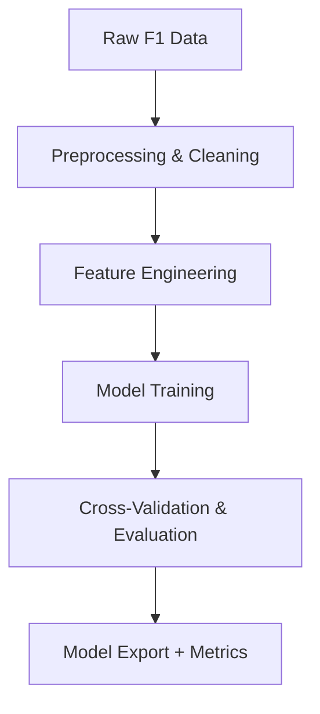

# 🧠 Model Design – F1 Podium Predictor

This document outlines the machine learning modeling strategy, model candidates, input/output formats, training pipeline, evaluation criteria, and deployment plans for future phases.

---

## 🎯 Problem Statement

> Binary classification problem: Will a driver finish on the podium (Top 3) or not?

- **Target Variable:** `Podium` (1 = Yes, 0 = No)
- **Input Features:** See `feature_plan.md` for full list
- **Granularity:** One row per driver per race

---

## 🧰 Candidate Models

| Model              | Why Use It? |
|--------------------|-------------|
| Logistic Regression| Baseline linear model for interpretability |
| Random Forest      | Handles non-linear data well, robust to outliers |
| XGBoost            | Excellent performance, supports feature importance |
| CatBoost           | Great for categorical-heavy datasets |
| LightGBM           | Fast gradient boosting, scalable |
| Neural Network     | Optional, for experimentation with deeper modeling |

---

## 🧪 Model Evaluation Strategy

| Metric            | Description |
|-------------------|-------------|
| **Precision@3**   | Accuracy of selecting top 3 finishers |
| **F1 Score**      | Harmonic mean of precision and recall |
| **ROC-AUC**       | Discrimination power |
| **Log-loss**      | Probability calibration |

**Cross-validation:**  
- K-Fold, stratified by **race ID** to prevent data leakage

---

## 🧱 Input & Output Format

**Input:**  
- Feature vector (numerical + encoded categorical)
- Stored in `data/processed/{version}/final_dataset.csv`

**Output:**  
- Model artifacts (`.pkl`, `.joblib`) → `models/{version}/`
- Evaluation results → `reports/{version}/metrics.json`

---

## ⚙️ Training Pipeline Overview

---

## 🔍 Model Explainability

- Use **SHAP** to identify most influential features
- Use **LIME** for local explanations (optional)
- Visualizations stored in `reports/{version}/explainability/`

---

## 🧪 Error Analysis Plan

- Confusion matrix on validation data
- Misclassification exploration:
  - Grid start vs finish deltas
  - Weather anomalies
  - Team failures (e.g. DNFs)

---

## 🚀 Deployment Plan

- Serve final model via **FastAPI**
- Input format: JSON race data
- Output: Probability of podium
- Endpoint: `/predict-podium`
- Response time target: < 500ms

---

## 📌 Versioning & Tracking

| Version   | Status     | Model Type     | Notes |
|-----------|------------|----------------|-------|
| v0_1_0    | ✅ Baseline | Rule-based     | Grid Position ≤ 3 |
| v0_2_0    | 🔜 Planned  | ML classifiers | Real data-based training |
| v0_3_0    | 🔜 Planned  | Ensemble/Stacked | Post-feature engineering |

---

_Last updated: April 2025_  
_Author: [Mantas](https://github.com/mantas123456)_
